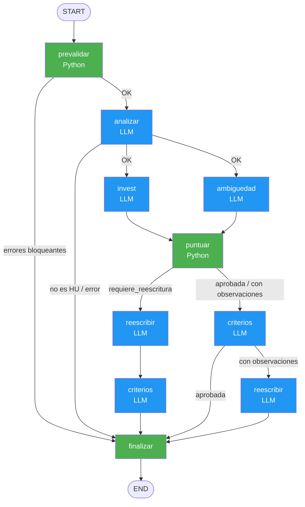
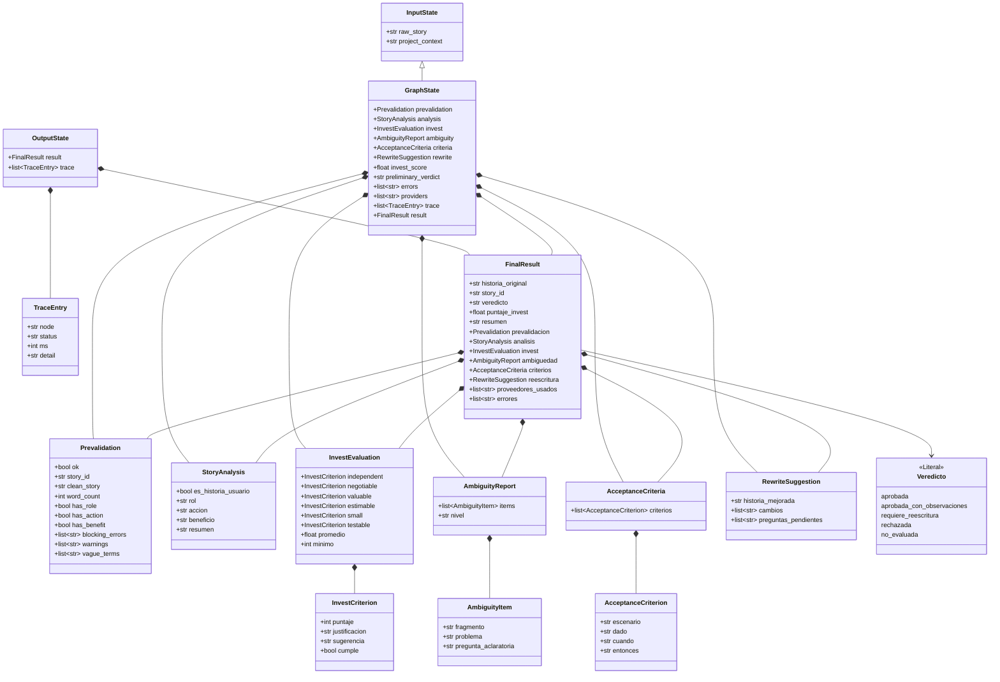

# Validador de Historias de Usuario (LangGraph + Gemini/Ollama + Streamlit)

Agente que valida historias de usuario con un flujo controlado: las reglas duras se
resuelven en **Python** (gratis, determinista) y el **LLM** solo interviene donde hace falta juicio.

## Flujo



🟢 = Python puro (gratis) | 🔵 = LLM (costo de inferencia)

## Diagrama de clases del flujo



**Relaciones:**
- `InputState ──► GraphState`: herencia (GraphState extiende InputState)
- `OutputState ◆── FinalResult`: composición (OutputState contiene FinalResult)
- `GraphState ◆── Prevalidation`: composición (GraphState contiene cada modelo)
- `FinalResult ◆── *`: composición (agrega todos los modelos como resultados)
- `FinalResult ──► Veredicto`: referencia (usa el tipo Literal Veredicto)

| Nodo | Tipo | Qué hace |
|---|---|---|
| prevalidar | Python | Limpia el texto, extrae el ID (HU-01), detecta rol/acción/beneficio, términos vagos y detalles técnicos. Corta el flujo si no es una HU (0 llamadas al LLM). |
| analizar | LLM | Descompone en rol / acción / beneficio y confirma que es una HU. |
| invest ∥ ambiguedad | LLM (paralelo) | Evaluación INVEST (6 criterios, 1–5) y lista de ambigüedades con preguntas para el PO. |
| puntuar | Python | Calcula el promedio INVEST y el **veredicto** con reglas fijas (el LLM no decide el veredicto). |
| criterios | LLM | Criterios de aceptación Gherkin (Dado / Cuando / Entonces). |
| reescribir | LLM | Historia mejorada en formato "Como…, quiero…, para…". |
| finalizar | Python | Ensambla el `FinalResult` (Pydantic). |

Veredictos: `aprobada`, `aprobada_con_observaciones`, `requiere_reescritura`, `rechazada`, `no_evaluada`.

## Instalación paso a paso

### 1. Entorno virtual e instalación

Linux / macOS:
```bash
python3 -m venv .venv
source .venv/bin/activate
pip install -r requirements.txt
```

Windows (PowerShell):
```powershell
python -m venv .venv
.venv\Scripts\Activate.ps1
pip install -r requirements.txt
```

### 2. Ollama (respaldo local)
```bash
ollama serve                 # si no está corriendo como servicio
ollama pull llama3.1:8b      # o el modelo que prefieras; ajusta OLLAMA_MODEL en .env
ollama list                  # verifica que aparezca
```

### 3. Variables de entorno
```bash
cp .env.example .env         # Windows: copy .env.example .env
```
Edita `.env` y pega tu `GOOGLE_API_KEY` (https://aistudio.google.com/apikey).
Sin clave, el sistema arranca solo con Ollama. Confirma que `GEMINI_MODEL` sea un modelo vigente.

### 4. Pruebas (no consumen LLM)
```bash
python -m pytest -q
```

### 5. Consola
```bash
python -m validador.cli "HU-01: Como pasajero, quiero ver las rutas, para saber cuáles existen."
python -m validador.cli --file historias_ejemplo.txt
python -m validador.cli --file historias_ejemplo.txt --json > resultados.json
```

### 6. Interfaz
```bash
streamlit run app.py
```
Abre http://localhost:8501. En la barra lateral eliges proveedor (automático, solo Gemini o solo Ollama),
ves el estado de cada uno y puedes editar el contexto del proyecto.

## Cómo funciona el respaldo Gemini → Ollama

Cada cadena es `prompt | llm.with_structured_output(Esquema) | etiqueta`, envuelta en:
1. `with_retry`: si la salida no cumple el esquema Pydantic, reintenta **una vez** en el mismo proveedor.
2. `with_fallbacks`: si sigue fallando, o hay error de red / cuota / timeout, pasa al siguiente proveedor.

Cada resultado indica qué proveedor lo produjo (`proveedores_usados`).

## Estructura

```
app.py                  Interfaz Streamlit
validador/
  config.py             Variables de entorno
  schemas.py            Modelos Pydantic (contratos de cada nodo)
  state.py              Estado del grafo con reducers (Annotated) e input/output schema
  prompts.py            ChatPromptTemplate
  llm.py                Gemini + Ollama y chequeo de salud
  chains.py             Cadenas LCEL con retry y fallbacks
  nodes.py              Nodos + reglas deterministas del veredicto
  graph.py              Aristas condicionales, paralelismo y compilación
  cli.py                Uso por consola
tests/test_graph.py     Pruebas del flujo con cadenas falsas
```

## Ajustes frecuentes
- **Umbrales del veredicto:** `APPROVE_THRESHOLD` y `MIN_THRESHOLD` en `.env`.
- **Modelo local pequeño que no respeta el esquema:** usa un modelo de 7–8B o más; los reintentos y el respaldo ayudan, pero un modelo muy pequeño fallará seguido.
- **Términos vagos / técnicos:** edita las listas `VAGUE_TERMS` y `TECH_TERMS` en `validador/nodes.py`.
